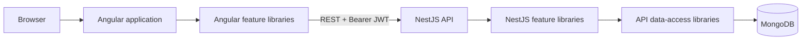

# GM Vocabulary

GM Vocabulary is a full-stack vocabulary learning application organized as an **Nx 23 monorepo**. The browser client is built with **Angular 22**, the REST API with **NestJS 12**, and application data is stored in MongoDB through Mongoose.

The repository is structured for continued growth: deployable applications are thin composition roots, while product code lives in domain-oriented Nx libraries with enforced dependency boundaries.

## Technology stack

| Area                 | Technology                                                                 |
| -------------------- | -------------------------------------------------------------------------- |
| Monorepo             | Nx 23.2, npm                                                               |
| Frontend             | Angular 22, standalone components, Signals, Signal Forms, NgRx SignalStore |
| UI                   | Angular Material, Tailwind CSS, SCSS                                       |
| Backend              | NestJS 12, Express, class-validator                                        |
| Persistence          | MongoDB, Mongoose 9                                                        |
| Testing              | Vitest, Playwright                                                         |
| Local infrastructure | Docker Compose                                                             |

## Architecture at a glance

```text
apps/gm-vocabulary       Angular bootstrap, root providers and routes
apps/api                 NestJS bootstrap and root module composition
apps/gm-vocabulary-e2e   Cross-application Playwright tests

libs/gm-vocabulary       Angular shell and business-domain libraries
libs/api                 NestJS feature and persistence libraries
libs/shared              Reusable frontend UI and utilities
```



The applications under `apps/` contain framework bootstrap and top-level composition. Capabilities are grouped under `libs/` by platform, domain, and responsibility:

- `feature` libraries orchestrate user journeys or expose NestJS modules.
- `ui` libraries contain presentational Angular components.
- `data-access` libraries own client state/API access or server persistence models.
- `util` libraries contain contracts and framework-light helpers.
- `feature-shell` owns the authenticated Angular layout and navigation.

Nx project tags (`scope:*`, `domain:*`, and `type:*`) and `@nx/enforce-module-boundaries` prevent invalid dependencies between layers. Public imports use library entry points such as `@gm-vocabulary/auth/data-access`; consumers do not reach into another library's internals.

See [Project structure](docs/architecture/project-structure.md) for the complete library map and [Architecture audit](docs/architecture/architecture-audit.md) for the current engineering assessment.

## Angular application

`apps/gm-vocabulary` is the Angular composition root. It owns `bootstrapApplication`, application-wide providers, root routing, global styles, and deployment assets. Route-level features are lazy-loaded from Nx libraries.

The client is divided into these domains:

- `auth`: authentication screens, guard/interceptor, session state, and API access.
- `vocabulary`: word list, editor, table UI, state, and API access.
- `collections`: collection list/details/editor, state, and API access.
- `feature-shell`: authenticated layout and primary navigation.
- `shared`: reusable UI controls, feedback components, types, validation, and environment values.

Angular Signals handle local and derived state, NgRx SignalStore provides domain state, and RxJS remains the asynchronous boundary for HTTP and dialog workflows.

## NestJS API

`apps/api` is the NestJS composition root. It configures the global API prefix, CORS, input validation, MongoDB, and the domain modules exposed by API libraries.

- `api-auth-feature`: JWT module, guard, and authenticated-user decorator.
- `api-users-feature`: signup, login, password hashing, and user persistence.
- `api-words-feature`: protected word endpoints and business rules.
- `api-collections-feature`: protected collection endpoints and ownership rules.
- `api-words-data-access` and `api-collections-data-access`: Mongoose entities and schemas.
- `api-shared-util`: reusable API pipes and helpers.

Requests follow the NestJS controller → service → Mongoose model flow. A global `ValidationPipe` transforms input, strips unknown fields, and rejects non-whitelisted properties. Word and collection routes are protected by the JWT guard; authorization is enforced by server-side ownership filters.

## Getting started

### Prerequisites

- Node.js 24
- npm 11
- Docker with Docker Compose, or a reachable MongoDB instance

Install dependencies:

```bash
npm ci
```

Copy `.env.example` to `.env` and replace the JWT placeholder with a long random value. `MONGODB_URI` is optional when using the default local MongoDB address.

```env
MONGODB_URI=mongodb://localhost:27017/gm-vocabulary
JWT_SECRET=replace-with-a-long-random-secret
```

### Run with Docker Compose

```bash
npm run docker:up
```

The Angular app is available at `http://localhost:4200`; the API listens at `http://localhost:3000/api`.

```bash
npm run docker:down
```

### Run locally

Start MongoDB, then run the API and frontend in separate terminals:

```bash
npm run start:server
```

```bash
npm start
```

## Development commands

| Command                | Purpose                                            |
| ---------------------- | -------------------------------------------------- |
| `npm start`            | Serve the Angular application                      |
| `npm run start:server` | Serve the NestJS API in development mode           |
| `npm run build`        | Build both deployable applications                 |
| `npm run lint`         | Lint all Nx projects and enforce module boundaries |
| `npm test`             | Run all configured unit/integration test targets   |
| `npm run test:api:e2e` | Run NestJS API end-to-end tests                    |
| `npm run e2e`          | Run Playwright end-to-end tests                    |
| `npm run e2e:ui`       | Run Playwright with its interactive UI             |
| `npm run typecheck`    | Type-check the Angular app and tests               |
| `npm run graph`        | Open the Nx project graph                          |

Useful Nx commands:

```bash
npx nx show projects
npx nx show project gm-vocabulary
npx nx graph
npx nx affected -t lint test build
```

Run a target for one project while iterating:

```bash
npx nx test gm-vocabulary-auth-data-access
npx nx lint api-words-feature
npx nx build api
```

## Adding code

Generate code in the library that owns the capability. Prefer an existing library until a new boundary has a clear owner, public API, and independent reason to change.

```bash
npx nx g @nx/angular:component user-menu \
  --project=gm-vocabulary-feature-shell \
  --changeDetection=OnPush \
  --export

npx nx g @nx/angular:library feature-review \
  --directory=libs/gm-vocabulary/vocabulary/feature-review \
  --tags=scope:gm-vocabulary,domain:vocabulary,type:feature

npx nx g @nx/js:library data-access \
  --directory=libs/api/review/data-access \
  --tags=scope:api,domain:review,type:data-access
```

After generation, expose intentional symbols through `src/index.ts`, refine project tags, and verify dependencies with lint and the Nx graph.

Nx references:

- [Workspace and project structure](https://nx.dev/concepts/decisions/folder-structure)
- [Project dependency rules](https://nx.dev/concepts/decisions/project-dependency-rules)
- [Enforce module boundaries](https://nx.dev/features/enforce-module-boundaries)
- [Nx generators](https://nx.dev/features/generate-code)

NestJS references:

- [Modules](https://docs.nestjs.com/modules)
- [Validation](https://docs.nestjs.com/techniques/validation)
- [MongoDB integration](https://docs.nestjs.com/techniques/mongodb)

## Authentication and security status

The current implementation provides bcrypt password hashing, JWT-protected endpoints, client route protection, automatic Bearer-token attachment, and server-side ownership checks. The access token is currently persisted in `localStorage`, and there is no refresh-token/session rotation flow. Treat the current authentication design as an intermediate stage, not a finished production security model.

Before a public production launch, address the prioritized findings in the [Architecture audit](docs/architecture/architecture-audit.md), especially token storage and rotation, secret management, word-to-collection integrity, rate limiting, health checks, and observability.
