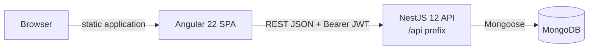
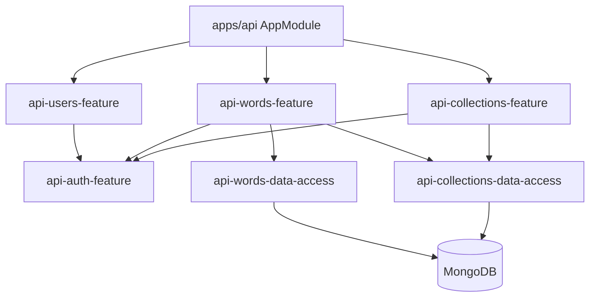

# GM Vocabulary — Architecture Audit

**Audit date:** 2026-09-03

**Scope:** Source-controlled applications, Nx libraries, configuration, tests, and deployment assets. Generated output, installed dependencies, and secret values were excluded.

**Method:** Static source review plus local Nx lint, test, and production-build validation performed after the library extraction.

## Executive summary

GM Vocabulary is an Nx 23 monorepo with an Angular 22 single-page application, a NestJS 12 REST API, and MongoDB persistence through Mongoose 9. The workspace follows a library-first Nx architecture: the three projects under `apps/` are composition/test roots, while frontend and backend capabilities live in 25 tagged libraries under `libs/`.

The refactored structure is a strong foundation for a medium-to-large product. Angular routes lazy-load domain feature libraries; the application shell has a dedicated owner; client state and HTTP access are separated from UI; NestJS feature modules are independent of their Mongoose schema libraries; and Nx module-boundary rules make dependency direction executable rather than conventional.

The codebase is structurally production-oriented, but it is not yet operationally production-ready. The highest-priority remaining issues are:

1. Word creation and reassignment accept a `groupId` without verifying that the collection exists and belongs to the authenticated user.
2. Access tokens are persisted in browser `localStorage`; refresh-token rotation, revocation, and server-side session management are absent.
3. Docker Compose supplies the literal development value `JWT_SECRET`, while runtime configuration has no schema-level startup validation.
4. Structured logging, request correlation, health/readiness endpoints, metrics, tracing, error reporting, and rate limiting are absent.
5. Deleting a collection can leave words with stale `groupId` references; the service contains an explicit TODO for this policy.

All 28 projects pass lint. The configured test run covers 16 test targets and passes 184 tests. Both Angular and NestJS production builds pass. The Angular build reports an initial raw bundle of 851.63 kB against a 500 kB warning budget; this is a performance warning, not a failed build. Browser E2E and API E2E suites require their runtime dependencies and were not part of the post-refactor validation run.

## 1. Workspace architecture

### Project inventory

The Nx workspace contains 28 projects:

- 3 applications: `gm-vocabulary`, `api`, and `gm-vocabulary-e2e`.
- 18 Angular libraries under `libs/gm-vocabulary` and `libs/shared`.
- 7 NestJS/API libraries under `libs/api`.

```text
apps/
├── api/                     NestJS composition root
├── gm-vocabulary/           Angular composition root
└── gm-vocabulary-e2e/       Playwright project

libs/
├── api/                     NestJS feature and persistence libraries
├── gm-vocabulary/           Product-specific Angular libraries
└── shared/                  Reusable frontend UI and utilities
```

This is an integrated Nx workspace with project-based libraries, not a package-based workspace. That is appropriate here: frontend and backend code share one release unit and toolchain, while Nx project boundaries provide task isolation, caching, ownership, and dependency control without requiring every internal library to be a publishable npm package.

### Runtime topology



The Angular application calls a compile-time configured API URL. NestJS exposes all routes below `/api`, enables CORS for the local and configured production frontend origins, and connects to MongoDB through `MongooseModule.forRootAsync`.

### Enforced boundaries

Projects are tagged on three axes:

- `scope:gm-vocabulary`, `scope:api`, or `scope:shared` identifies the platform/ownership boundary.
- `domain:auth`, `domain:vocabulary`, `domain:collections`, `domain:shell`, or `domain:shared` identifies the business boundary.
- `type:app`, `type:e2e`, `type:feature`, `type:ui`, `type:data-access`, or `type:util` identifies architectural responsibility.

The root ESLint configuration uses `@nx/enforce-module-boundaries` to constrain dependency direction:

- feature libraries may compose allowed feature, UI, data-access, and utility layers;
- UI libraries cannot reach upward into features or data access;
- data-access libraries cannot depend on UI or features;
- utility libraries remain at the bottom of the graph;
- Angular and API scopes cannot import each other's implementation libraries.

Libraries expose intentional public APIs through `src/index.ts`, and application imports use aliases such as `@gm-vocabulary/vocabulary/feature-list`. This removes deep cross-library imports and makes refactoring boundaries explicit.

The detailed library map is maintained in [project-structure.md](project-structure.md).

## 2. Angular architecture

### Composition root and shell

`apps/gm-vocabulary` owns application bootstrap, root providers, root routes, global styles, and assets. It does not own feature implementation.

`libs/gm-vocabulary/feature-shell` owns the authenticated application layout (`PageWrapperComponent`) and navigation. A single shell library is proportionate to the current shell: it contains presentation and route composition, but no independent API or complex shell state. If the shell later gains substantial session orchestration or independently reusable navigation widgets, those concerns can be extracted into `shell/data-access` or `shell/ui` without changing the route contract.

### Domain libraries

| Domain         | Libraries                                                                  | Responsibility                                                                       |
| -------------- | -------------------------------------------------------------------------- | ------------------------------------------------------------------------------------ |
| Authentication | `feature-auth`, `data-access`, `ui`, `util`                                | Login/signup journey, session state, guard/interceptor, API access, forms, contracts |
| Vocabulary     | `feature-list`, `feature-editor`, `ui`, `data-access`, `util`              | Word browsing/editing, presentation, state, API access, contracts                    |
| Collections    | `feature-list`, `feature-details`, `feature-editor`, `data-access`, `util` | Collection journeys, state, API access, contracts                                    |
| Shell          | `feature-shell`                                                            | Authenticated layout and navigation                                                  |
| Shared         | `shared-ui`, `shared-util`, `shared-environments`                          | Cross-domain controls, feedback, helpers, types, compile-time environment values     |

Feature libraries are routed boundaries and orchestrators. Presentational components are reusable without importing feature state. Data-access libraries own HTTP services, SignalStores, guards/interceptors, and orchestration services. Utility libraries own contracts, enums, validation, and framework-light helpers.

### Routing, state, and rendering

The application uses standalone components and `bootstrapApplication`; no Angular `NgModule` is required. Root routes lazy-load authentication, vocabulary, collection-list, and collection-detail features through public library entry points. Authenticated pages render inside the shell and use `authGuard`; NestJS authorization remains the security boundary.

Angular Signals are the primary synchronous state abstraction. NgRx SignalStore provides root domain state for authentication, words, and collections. RxJS handles HTTP and dialog workflows. Loading and error state is sometimes kept in orchestration services separately from entity state in stores; standardizing request-state ownership would reduce duplication as domains grow.

The project is a client-rendered SPA. SSR, hydration, and prerendering are not configured. There is no wildcard/404 route, resolver strategy, or custom preloading strategy.

### Frontend security and errors

Implemented controls include an Angular auth guard, Bearer-token/401 interceptor, token-expiry timer, session restoration, reusable error normalization, and snackbar feedback.

The access token, user ID, and expiry are stored in `localStorage`. Any successful XSS can therefore read the bearer credential. For a public production system, prefer a backend-for-frontend or secure `HttpOnly`, `Secure`, appropriately `SameSite` cookie design with CSRF protection where applicable. If bearer access tokens remain, use short lifetimes plus refresh-token rotation, reuse detection, revocation, and a documented logout/session policy.

## 3. NestJS architecture

### Composition root and modules

`apps/api` contains `main.ts` and `AppModule`. It configures the global `api` prefix, `ValidationPipe`, CORS allow-list, configuration loading, MongoDB connection, and domain feature modules.

Feature implementations live in `libs/api/*/feature`. Mongoose entities and schemas live in domain `data-access` libraries. Cross-cutting API helpers live in `api-shared-util`.



### Request and persistence flow

The server uses controller → service → Mongoose model flow. DTOs use `class-validator`, and object IDs are parsed by a shared custom pipe. Protected controllers use the JWT guard and current-user decorator. Most updates/deletes include the authenticated user ID in database filters, preventing modification of another user's records.

Direct model injection is reasonable at the current scale, but it couples domain services to Mongoose query mechanics. Introduce repository/port abstractions when business rules become complex, transactional workflows span aggregates, persistence must be replaceable, or model-heavy mocking makes tests brittle—not solely to add another layer.

### Integrity gaps

Word `create` and `update` convert a supplied `groupId` to an ObjectId but do not verify that the referenced collection exists or belongs to the current user. Validate the collection using both `_id` and `userId` before persisting and cover the rule with authorization tests.

Collection deletion currently deletes only the collection. Choose and enforce one invariant:

- delete child words transactionally;
- unset `groupId` on affected words transactionally; or
- reject deletion while child words exist.

The selected behavior should be covered by API integration tests and, if multiple writes are involved, a MongoDB transaction where the deployment topology supports it.

### Configuration and operations

`ConfigModule` is global, but values are unvalidated strings and JWT verification reads `process.env.JWT_SECRET` directly. Add a typed configuration factory and startup schema validation for `JWT_SECRET`, `MONGODB_URI`, `PORT`, token lifetimes, and allowed origins. Signing and verification should consume the same injected source.

The repository does not provide structured application logging, correlation IDs, health/readiness endpoints, metrics, distributed tracing, external exception reporting, or rate limiting. These are required production capabilities, especially for authentication endpoints.

## 4. Testing and quality gates

- Angular app/library tests use Vitest-backed Angular unit-test targets.
- NestJS specs are centralized under the API Vitest configuration and include tests in API libraries.
- Playwright owns browser workflows in `apps/gm-vocabulary-e2e`.
- A separate API E2E Vitest configuration exists for HTTP-level tests.
- ESLint runs per Nx project and enforces code quality and project boundaries.

| Check                      | Result                                          |
| -------------------------- | ----------------------------------------------- |
| `npm run lint`             | Pass: 28 Nx projects                            |
| `npm test`                 | Pass: 16 targets, 184 tests                     |
| Angular production build   | Pass with bundle-budget warning                 |
| NestJS production build    | Pass                                            |
| Angular initial raw bundle | 851.63 kB; warning threshold 500 kB             |
| Playwright/API E2E         | Configured; not run in post-refactor validation |

The bundle warning should be investigated with bundle analysis. Likely contributors must be measured before changing dependencies or budgets. Increase the warning limit only after agreeing on an explicit performance budget.

Recommended CI gate:

```bash
npx nx affected -t lint test build
```

Run API and browser E2E suites as separate jobs with MongoDB and both applications available. Add coverage thresholds selectively around authorization, authentication, integrity rules, and state transitions.

## 5. Deployment assessment

Docker Compose is suitable for local development. It starts MongoDB and development servers with bind mounts. The API Dockerfile includes build and non-root production stages, while the repository does not define a production frontend image or complete production orchestration.

Before production deployment, add secret injection, MongoDB authentication/backups/restore testing, health checks, readiness-aware startup, TLS/gateway policy, resource limits, graceful shutdown, immutable artifacts, environment-specific CORS, release observability, and rollback procedures.

## 6. Prioritized recommendations

### P0 — correctness and credential safety

1. Validate word `groupId` existence and ownership on create and update.
2. Decide and implement the collection-deletion invariant for related words.
3. Replace the browser token design with a documented production session strategy; add refresh rotation/revocation if sessions persist.
4. Enforce strong externally supplied JWT secrets and fail startup through validated configuration.

### P1 — production operations

1. Add login/signup rate limiting and appropriate abuse controls.
2. Add structured logs, request correlation, centralized exceptions, and sensitive-field redaction.
3. Add liveness/readiness endpoints, metrics, tracing, and error reporting.
4. Run API and browser E2E suites in CI with real service dependencies.
5. Analyze and reduce the Angular initial bundle against an explicit performance budget.

### P2 — scalability and consistency

1. Standardize client loading/error/request-state ownership.
2. Add a wildcard route and explicit not-found experience.
3. Add runtime frontend configuration if one artifact must serve multiple environments.
4. Consider persistence ports/repositories when complexity or transactions justify them.
5. Add Nx ownership metadata/CODEOWNERS as team boundaries emerge.

## 7. Changes from the previous architecture

The earlier audit described product code living directly under `apps/*` and an effectively empty `libs/` directory. That is no longer true. The refactor introduced:

- thin Angular and NestJS composition roots;
- domain-oriented Angular feature, UI, data-access, and utility libraries;
- a dedicated Angular shell library;
- NestJS feature libraries and separate Mongoose data-access libraries;
- stable TypeScript aliases and library public APIs;
- scope/domain/type project tags and enforced module boundaries;
- per-library Angular tests and API test discovery across API libraries.

Older Nx patterns that assume all code belongs under `apps/<app>/src/app`, require `NgModule`-based Angular libraries, prescribe one monolithic `shared` library, or split every concern into a publishable package do not describe this workspace. Current Nx architecture is driven by project boundaries, ownership, dependency direction, and build/test needs—not by a mandatory folder layout alone.

## Conclusion

The workspace now has a credible production-scale code organization. Nx boundaries match Angular and NestJS responsibilities, the shell has a clear owner, domains can evolve independently, and applications remain small. The next phase should focus less on creating libraries and more on runtime correctness, credential/session security, operational visibility, E2E confidence, and measured frontend performance.

Primary references:

- [Nx workspace and project structure](https://nx.dev/concepts/decisions/folder-structure)
- [Nx project dependency rules](https://nx.dev/concepts/decisions/project-dependency-rules)
- [Nx module-boundary enforcement](https://nx.dev/features/enforce-module-boundaries)
- [NestJS modules](https://docs.nestjs.com/modules)
- [NestJS configuration](https://docs.nestjs.com/techniques/configuration)
- [NestJS validation](https://docs.nestjs.com/techniques/validation)
- [NestJS MongoDB integration](https://docs.nestjs.com/techniques/mongodb)
