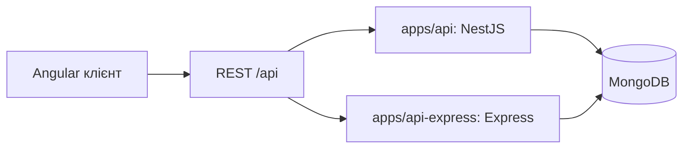

# NestJS і Express.js у GM Vocabulary: архітектурні компроміси

Цей документ порівнює **дві реалізації того самого REST API** в цьому репозиторії: робочий [NestJS API](../../apps/api/src/app.module.ts) та окремий [Express API](../../apps/api-express/src/app.js), відновлений з версії до міграції й адаптований до поточних маршрутів. Обидва працюють із MongoDB через Mongoose та обслуговують `/api/auth`, `/api/words` і `/api/collections`.

Ключове уточнення: NestJS тут працює **поверх Express** через [ExpressAdapter](../../apps/api/src/main.ts). Порівнюємо організацію застосунку та інструменти розробки, а не два незалежні HTTP рушії.

## Що саме порівнюємо

| Спільне | Межа порівняння |
| --- | --- |
| Маршрути, JWT, перевірка вхідних даних, права власника, Mongoose і формат основних відповідей | Nest написаний на TypeScript і розбитий на Nx бібліотеки; Express написаний на JavaScript і зібраний в одному Nx застосунку. Тому кількість файлів, рядків або час збірки **не є чесною метрикою переваги фреймворку**. |

Express варіант зберігає підхід попередньої реалізації, але не повторює її старі маршрути й помилки авторизації. Це порівняння рішень для **поточного** продукту, а не точний знімок історичного коду. Обидва API можна запустити окремо; інструкції є в [README Express застосунку](../../apps/api-express/README.md).

## Компроміси за архітектурними рішеннями

| Питання | NestJS у проєкті | Express.js у проєкті | Виграш і ціна |
| --- | --- | --- | --- |
| **Складання застосунку** | [AppModule](../../apps/api/src/app.module.ts) імпортує доменні модулі; кожен оголошує контролери, providers та імпортовані залежності. | [createApp](../../apps/api-express/src/app.js) явно створює middleware, передає моделі фабрикам маршрутів і монтує routers. | Nest показує граф залежностей у деклараціях модулів і перевіряє наявність providers при запуску. Express дає прямий контроль та менше концепцій; правильну структуру залежностей команда підтримує сама. |
| **Маршрути і бізнес логіка** | [WordsController](../../libs/api/words/feature/src/lib/words/words.controller.ts) приймає HTTP запит і делегує [WordsService](../../libs/api/words/feature/src/lib/words/words.service.ts). | [wordRoutes](../../apps/api-express/src/words.js) одночасно оголошує маршрут, перевіряє дані й виконує запит до моделі. | У Nest розділення вже закладене в застосованому шаблоні; легше знайти місце для нового правила. Express дозволяє такий самий поділ на router і service, але його треба запровадити окремо. Для малого API один обробник може бути простішим. |
| **Залежності та тестування** | Сервіс отримує Mongoose моделі через `@InjectModel`; Nest зв'язує їх через [WordsModule](../../libs/api/words/feature/src/lib/words/words.module.ts). | [createApp](../../apps/api-express/src/app.js) приймає `models` і `jwtSecret` як аргументи; [HTTP тести](../../apps/api-express/test/api.test.js) передають підміни. | Обидва підходи дозволяють ізольовані тести. Nest знімає ручне зв'язування, коли залежностей багато, але додає DI tokens, модулі й правила реєстрації. Express тримає залежності явними у виклику функції, проте точка складання може розростатися. |
| **Автентифікація** | [JwtAuthGuard](../../libs/api/auth/feature/src/lib/auth/guards/jwt-auth.guard.ts) застосовується до захищених контролерів; `@CurrentUser()` передає ідентичність у метод. | [authenticate](../../apps/api-express/src/auth.js) є middleware; [app.js](../../apps/api-express/src/app.js) передає його захищеним routers. | Nest дає єдину модель guard для доступу до маршруту. Express middleware тут достатній і зрозумілий. **Жоден підхід не замінює перевірку власника в запиті до БД.** |
| **Валідація** | Глобальний [ValidationPipe](../../apps/api/src/main.ts), DTO з декораторами та окремий pipe для ObjectId. | [validation.js](../../apps/api-express/src/validation.js) містить функції, які кожен handler викликає явно. | Nest зручніший, коли багато DTO і потрібне однакове правило для всіх маршрутів; ціною є декоратори, metadata та знання життєвого циклу pipes. Express залишає послідовність перевірок очевидною, але виклик легко пропустити при додаванні маршруту. Схемна бібліотека могла б зменшити цей ризик. |
| **Помилки** | Сервіси кидають `NotFoundException`, `ConflictException` тощо; Nest формує HTTP відповідь. | [HttpError та errorHandler](../../apps/api-express/src/http.js) задають формат і статус відповіді. | Nest надає готовий узгоджений механізм. Express теж потребує лише одного централізованого middleware, але його поведінку та формат команда визначає і підтримує сама. |
| **MongoDB** | `MongooseModule.forRootAsync()` створює з'єднання, `forFeature()` реєструє моделі для модулів. | [server.js](../../apps/api-express/src/server.js) відкриває з'єднання; [models.js](../../apps/api-express/src/models.js) створює моделі та передає їх до маршрутів. | Mongoose працює без Nest. Nest інтегрує моделі в DI і модульні межі; Express робить порядок створення та передавання залежностей видимим у коді. |
| **Підготовка до запуску** | Поточний Nest застосунок має Nx `build`, `serve` та Dockerfile. | Порівняльний Express застосунок має Nx `serve`, `test`, `lint` і запускає JavaScript з джерел; production bundle для нього не налаштовано. | Це **різниця конфігурації цих двох застосунків**, а не вроджена перевага Nest: Express також можна зібрати й розгортати окремо. |

## Один запит у двох реалізаціях

Для `PUT /api/words/:id` обидва API мають забезпечити однаковий ланцюг:

1. Перевірити Bearer JWT і отримати `userId`.
2. Перевірити `id` та тіло запиту.
3. Оновити слово з фільтром **`{ _id: id, userId }`**.
4. Повернути 404, якщо слово не знайдене або належить іншому користувачу.

У Nest кроки розподілені між [guard](../../libs/api/auth/feature/src/lib/auth/guards/jwt-auth.guard.ts), [pipe і DTO](../../libs/api/words/feature/src/lib/words/words.controller.ts), [controller](../../libs/api/words/feature/src/lib/words/words.controller.ts) та [service](../../libs/api/words/feature/src/lib/words/words.service.ts). У Express вони викликаються у [router](../../apps/api-express/src/words.js), який користується [middleware](../../apps/api-express/src/auth.js) і [функціями валідації](../../apps/api-express/src/validation.js).

Архітектурно важливий не синтаксис маршруту, а останній фільтр: валідний JWT сам по собі **не дає права змінити будь-яке слово**. Цей бізнес інваріант доводиться реалізувати в обох версіях.

## Що пришвидшує або сповільнює розробку

| Ситуація | Практичний вибір |
| --- | --- |
| Кілька простих endpoint, одна команда, майже немає спільних правил | Express часто потребує менше стартових рішень і коду. Nest може додати структуру раніше, ніж вона окупиться. |
| Зростає кількість доменів, DTO, залежностей і спільних правил | Nest дає однакові місця для controllers, services, guards і pipes. Це може зменшити час на орієнтацію та інтеграцію змін, якщо команда дотримується цих меж. |
| Команда має усталену Express архітектуру, DI/валідацію і правила тестів | Перехід на Nest не гарантовано дасть виграш: треба врахувати вартість міграції й навчання. |
| Потрібні максимальна явність та контроль над HTTP конвеєром | Express може бути зручнішим; у Nest треба знати порядок виконання middleware, guards, pipes та обробки помилок. |

У цьому проєкті Nest виправданий як **спільний каркас для кількох доменів із повторюваними правилами доступу й валідації**. Це оцінка підтримуваності коду, а не твердження, що Nest автоматично швидший у runtime чи безпечніший. Вимірювань продуктивності цих двох застосунків тут немає.

## Що не слід приписувати NestJS

- **Nx monorepo та правила імпортів** налаштовані окремо через [Nx ESLint constraints](../../eslint.config.js). Nest модулі керують providers під час роботи застосунку; Nx перевіряє дозволені залежності між бібліотеками під час розробки. Порівняльний Express API поки розташований в одному Nx застосунку; його також можна рознести на бібліотеки.
- **TypeScript** використаний у Nest варіанті, JavaScript — в Express варіанті. Express також підтримує TypeScript; статична типізація не є унікальною властивістю Nest.
- **Безпека та цілісність даних** залежать від реалізованих правил. В обох версіях потрібно додати перевірку існування й власника колекції перед призначенням `groupId`, а також визначити, що робити зі словами при видаленні колекції.
- **Операційна готовність** не виникає автоматично: обом API потрібні перевірена конфігурація, rate limiting, спостережуваність та наскрізні тести з реальною БД. Поточні тести Express використовують підмінені моделі; це не доказ повної паритетності поведінки.

## Коротка відповідь для співбесіди

> «Ми могли залишитися на Express: NestJS у цьому проєкті навіть використовує Express як HTTP adapter. Причина вибору Nest — не можливість приймати запити, а спільна структура для зростаючого API. Модулі описують залежності між auth, words і collections; DI зв'язує сервіси з моделями; guards і pipes задають однакові місця для перевірки доступу та даних. Express варіант показує, що ті самі правила реалізуються middleware, фабриками маршрутів і ручною валідацією. Для маленького API це простіше, але з новими доменами команді доводиться підтримувати більше власних домовленостей. Nest має ціну у вигляді додаткових абстракцій, тому я оцінюю його через підтримуваність і складність змін, а не через кількість декораторів або обіцяну швидкодію».
